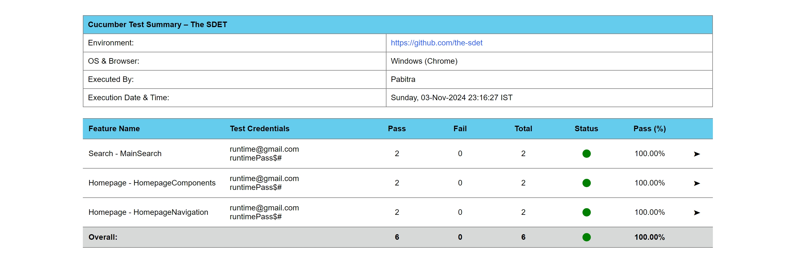
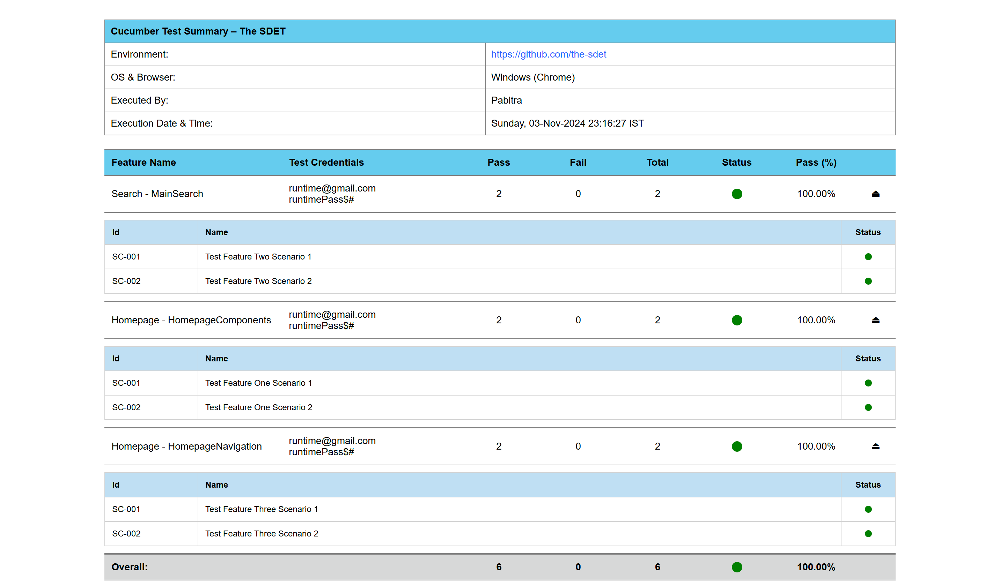

## This Repo is an example of using cucumber-summary-reporter
### https://github.com/the-sdet/cucumber-summary-reporter

# Cucumber Summary Reporter

### Cucumber Summary Report

### Cucumber Summary Report Extended

### Authors

[@the-sdet](https://github.com/the-sdet)

[@pabitra-qa](https://github.com/pabitra-qa)

### 🚀 About Me

I'm a dedicated and passionate Software Development Engineer in Test (SDET) trying to help the community in focusing in
building great automation frameworks rather than writing the same utilities again and again and again...

### Connect With Me

&nbsp; 

### Feedback

If you have any feedback, please reach out to us at [contact.the.sdet@gmail.com](mailto:contact.the.sdet@gmail.com).